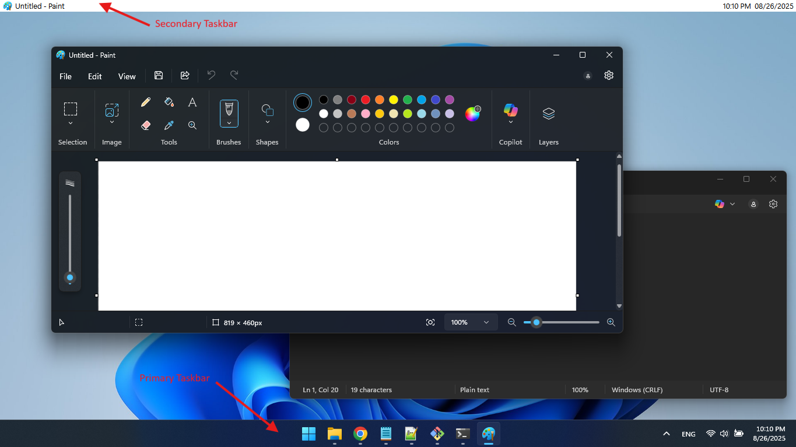

# Windows Taskbar Top

A custom additional taskbar to the top on windows (**Secondary Taskbar**) written in **Python + PyQt6**, that displays:
- 🖼️ Active application icon  
- 📝 Active application window title  
- ⏰ A real-time clock  

This taskbar pins itself to the **top of the screen** using Windows AppBar API.


## ✨ Features
- Always-on-top, frameless bar at the top of your screen  
- Shows **current active window title** and its **application icon**  
- Displays a **live digital clock** (updates every second)  
- Automatically updates when switching between applications  


## 📸 Screenshot




## ⚙️ Requirements

- Windows 10/11
- Python **3.9+**  
- Install dependencies:

```bash
pip install -r requirements.txt
```

**`requirements.txt` contents:**
```
PyQt6
psutil
```


## 🚀 Run from Source

Clone this repo:

```bash
git clone https://github.com/rethseakhong/windows_taskbar_top.git
cd windows_taskbar_top
```

Run the script:

```bash
python main.py
```

The dock will appear at the **top of your primary screen**.  
Close the dock normally (**Alt+F4**) to unregister from AppBar.


## 📦 Build Executable (PyInstaller)

You can convert the script into a standalone `.exe` using **PyInstaller**.

1. Install PyInstaller:

```bash
pip install pyinstaller
```

2. Build the executable:

```bash
pyinstaller --noconsole --onefile windows_taskbar_top.py
```

- `--noconsole` → prevents the terminal from showing  
- `--onefile` → bundles everything into a single `.exe`  

3. The `.exe` file will be located in the **`dist/`** folder.


## 🛠️ Technical Details

- **AppBar integration** via `SHAppBarMessage` to reserve space at the top of the screen  
- **Windows API calls** (via `ctypes`) extract the app icon from the foreground process executable  
- **PyQt6 GUI** provides the dock, labels, and real-time updates  
- **psutil** used to get process info from a window handle  


## 📌 Additional Info
- Only docks to the **primary monitor** (no multi-monitor support yet)  
- Icons may fail to load for system windows without valid executables  
- Currently **white theme only** (can be themed via stylesheet)  
- Source code is free to use, you can add ideas / features to it  😁


## ⚡ Optional: Run on Startup (Windows)

### Method 1: Startup Folder

To make your dock start automatically when Windows logs in:  

1. **Copy the `.exe` to a folder**, e.g., `C:\Program Files\WindowsTaskbarTop`.  
2. Press `Win + R`, type `shell:startup`, and press Enter → opens your Startup folder.  
3. Create a shortcut to your `.exe` inside this folder.  

> Now your dock will launch automatically on Windows startup.

### Method 2: Task Scheduler

1. **Copy the `.exe` to a folder**, e.g., `C:\Program Files\WindowsTaskbarTop`.
2. Open **Task Scheduler** → Create Task (not basic).  
3. In **General**:
   - Name it `TaskbarTop`  
   - Select **Run only when user is logged**  
   - Check **Run with highest privileges**
4. In **Triggers**:
   - New → Begin the task: **At log on** → Any user  
5. In **Actions**:
   - Action: **Start a program**
   - Program/script: full path to your `.exe`  
6. In **Conditions**:
   - Uncheck Start the task only if the computer is on AC power if needed.
76. Save and restart → dock launches automatically.


## 📜 License
MIT License — free to use and modify.

